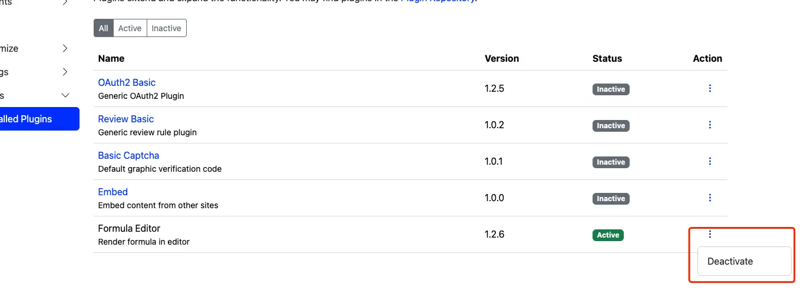
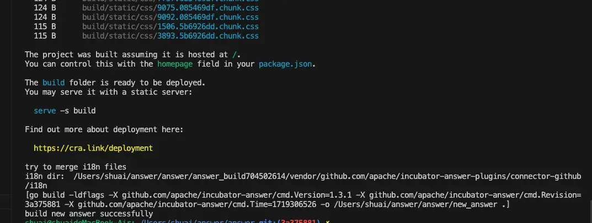
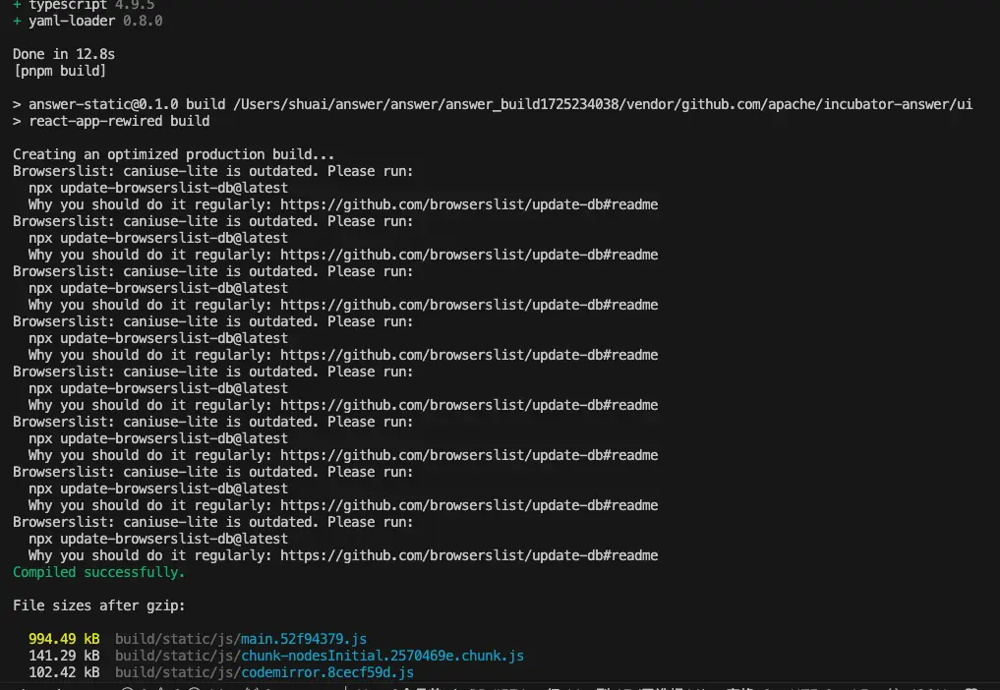
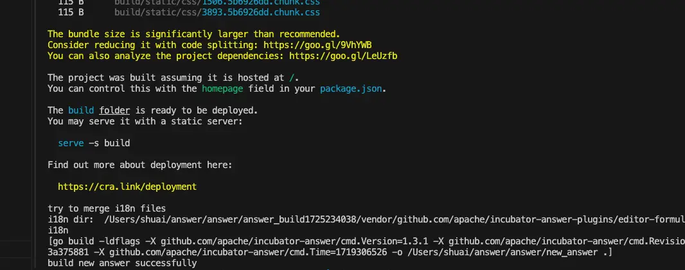

We’ve noticed that some users are struggling to package Answer plugins. It might be frustrating since the doc [using plugins](https://answer.apache.org/docs/plugins/) doesn’t contain successful packaging examples.

In this blog, we’ll guide you through the process of packing your Answer plugin with step-by-step tutorial.

## Getting Started

To get started, please make sure you have a development environment set up with the following: Node.js, pnpm, Docker, Go etc. Don’t forget to check the official documentation for [development guide](https://answer.apache.org/docs/development/).

## Notice

**Skip this section if you’re using the latest code.**

In Answer 1.3.5, the plugin build process and some plugin commands have been adjusted. If you are using code from before 1.3.5, you need to change the basic information of some internal plugins. The plugins involved are:

1. editor-chart
2. editor-formula
3. embed-basic (only available 1.3.5 and later)

Find the [commit ID](https://github.com/apache/incubator-answer-plugins/commit/e224fee9b8a0b936e143e852050d9345aa249201) for the plugin you need to update. In its package.json files, the hyphens (-) in the plugin name with underscores (\_). For instance:


## I. Build Docker Images with Plugins

There’re two ways to build Docker images with plugins:

1. Answer Base Image
2. Local Code

### Build from Answer Base Image

If there’s no need to modify Answer's source code, you can build directly from official base images. Please check our [docs](https://answer.apache.org/docs/plugins/#build-with-plugin-from-answer-base-image) on building with plugin from answer base image.

### Build Docker Images From Local Code

Please keep local code up-to-date. The steps are as below:

1. **Add Pluins**：Edit `/script/plugin_list` (root directory) and add plugin repository URLs (one per line).
2. **Build Docker Image**：Run command: `docker build -t <image_name[:tag]> .` .
3. **Launch and Verify**：Wait for build to finish, then run `docker run -d -p 9080:80 -v answer-data:/data --name <container_name> <image_name>`, then verify plugins in Answer 。

### 1.Add Required Plugins

```
github.com/apache/incubator-answer-plugins/connector-basic@latest
github.com/apache/incubator-answer-plugins/reviewer-basic@latest
github.com/apache/incubator-answer-plugins/captcha-basic@latest
github.com/apache/incubator-answer-plugins/editor-formula@latest

```

### 2.Build Docker Image

The build process may take some time.


### 3.Local Start up and Verification

Run the following command to start locally and follow the [documentation](https://answer.apache.org/docs/installation#install-steps) to complete initialization.

```
docker run -d -p 9080:80 -v answer-data:/data --name answer101 answer-plugin
```

After initialization, log in to the admin panel and see if the plugin runs correctly.

Admin Panel


Activate the Plugin


Verify Plugin(editor-formula) Functionality：


## II. Build a Binary with Plugins

Here, we will walk you through the process of building an Apache Answer binary that includes specific plugins. The process involves building the base binary, incorporating the required plugins, locally verifying the plugins, and finally deploying the binary.

### Steps

1. Build Base Binary
2. Build Plugin Binary
3. Verify
4. Deploy

### 1.Build Base Binary

Start with building the front-end static resources using the command `make ui`.

Output:

1. Installing Dependencies
   
2. Dependency InstallationBuilding Static Resources after Dependency Installation
   

To build the base binary, run `make build`. If the build is successful, the answer binary will be generated in the project root directory.

If you encounter errors related to Go dependency installation, you can try running `go mod download` locally to see if the installation is successful. If it still fails, consider configuring a domestic mirror: https://goproxy.cn/ or enabling a network proxy.

Success：


### 2.Build a Binary File with the Required Plugins Using the Base Binary File

Please view [Answer plugin docs](https://answer.apache.org/docs/plugins/#binary-build).

```
# answer build --with [plugin@plugin_version=[replacement]] --output [file]
$ ./answer build --with github.com/apache/incubator-answer-plugins/connector-github

# build a new answer with github login plugin then output to ./new_answer.
$ ./answer build --with github.com/apache/incubator-answer-plugins/connector-github@1.0.0 --output ./new_answer

# with multiple plugins
$ ./answer build \
--with github.com/apache/incubator-answer-plugins/connector-github \
--with github.com/apache/incubator-answer-plugins/connector-google

# with local plugins
$ ./answer build --with github.com/apache/incubator-answer-plugins/connector-github@1.0.0=/my-local-space

# cross compilation. Build a linux-amd64 binary in macos
$ CGO_ENABLED=0 GOOS=linux GOARCH=amd64 ./answer build --with github.com/apache/incubator-answer-plugins/connector-github

# specify the answer version using ANSWER_MODULE environment variable
$ ANSWER_MODULE=github.com/apache/incubator-answer@v1.2.0-RC1 ./answer build --with github.com/apache/incubator-answer-plugins/connector-github
```

You can choose the required plugins according to the instructions in the documentation. Compiling plugins will rebuild the front-end static resources. Plugins may have special dependencies, so dependency installation and compilation will be performed again here. After successful compilation, the `new_answer` binary file will be generated in the dist directory.

Example:


#### 2.1.Build Single Plugin

`./answer build --with github.com/apache/incubator-answer-plugins/connector-github`

Effect:




Verify plugin installation command: `./new_answer plugin`.


#### 2.2.Build Single Plugin Using Local Plugin Code

If you need to modify some plugin information or build a plugin using your own private implementation, you need to use the command `with local plugins`. For example, the `editor-formula` plugin mentioned above is compatible with Answer versions below 1.3.5, so you need to modify some plugin information. In this case, you can use the following command to build the plugin:

`./answer build --with github.com/apache/incubator-answer-plugins/editor-formula@0.0.3=/Users/shuai/answer/plugins/editor-formula`

Output:






Verify plugin installation command: `./new_answer plugin`.


#### 2.3.Build Multiple Plugins

The process for building multiple plugins is similar to building a single plugin. Please kindly refer to building single plugin and try it yourself.

### 3.Verify Plugins Locally

Using the command line only ensures that the plugins have been installed. To check if the plugins are running correctly, you can run the generated binary file locally. Please refer to the [installation documentation](https://answer.apache.org/docs/installation) for instructions on initializing the information.


Please pay attention that you need to run the new_answer binary, so replace ./answer with ./new_answer in the command line.

### 4.Steps for Local Verification

1. Initialization Complete\
   For example: `INSTALL_PORT=80 ./new_answer init -C ./answer-data`


Access [http://localhost:80/install/](http://localhost:80/install/) and follow the [instructions](https://answer.apache.org/docs/installation#install-steps) to complete the initialization process.

2. Update Information\
   Run the command  `./new_answer upgrade -C ./answer-data/`

3. Start the Local Website\
   Run `./new_answer run -C ./answer-data/`， access `http://localhost/`. Log in and go `http://localhost/admin` to activate and verify the plugin.

Here’s an example of editor-formula plugin.


At this point, you can make sure that the plugin has been built correctly and running.

### 5.Deploy the Binary

If your website is deployed using a binary, you can now deploy the generated binary file. If you need to adapt to different platforms, you can use the cross-compilation commands in the documentation to build the binary file.
