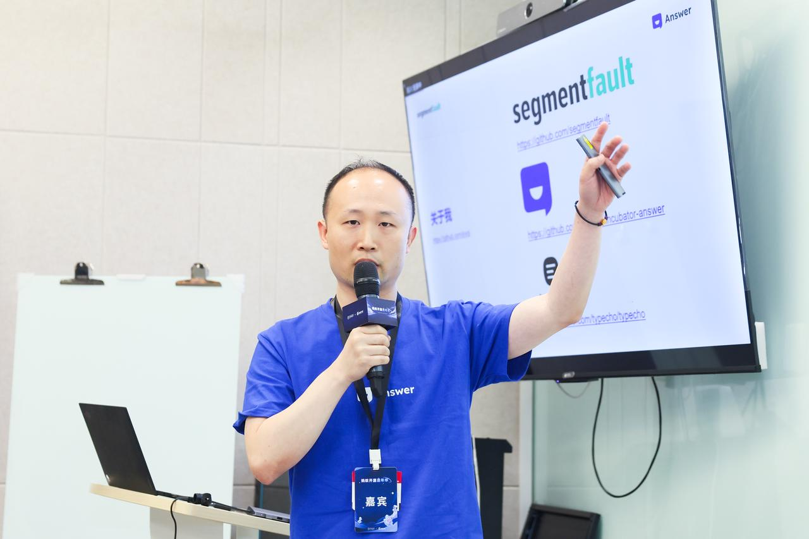

May 28th, Apache Local Community Hangzhou (ALC Hangzhou) held its first offline meetup successfully.  Apache Answer, as an incubating project within the Apache Software Foundation (ASF), was represented by most of its Project Management Committee (PPMC) members. Joyqi, PPMC member of Answer, introduced Answer with a presentation in the meetup. The presentation covered the project roadmap, community management, contributions, etc.

The meetup attracted a range of attendees from Apache ecosystem. PMC members and core committers from projects including Apache Dubbo, Apache RocketMQ, Apache Flink, Apache Paimon, Apache Fury, Apache Celeborn, and Apache HoraeDB shared and exchanged ideas on open-source field. Additionally, Ni Chao, professor of the School of Software Technology, Zhejiang University also participated in the event.

Nadia Jiang, PPMC member of Answer, delivered opening remarks at the meetup. She shared her memory of joining the first ALC Beijing offline meetup and later became an organizer for the first CommunityOverCode Asia (formerly ApacheCon Asia).

2024 is a milestone for Hangzhou open-source communities — the establishment of ALC Hangzhou, and the upcoming CommunityOverCode Asia 2024 conference, scheduled to take place in Hangzhou from July 26th to 28th. Both are poised to propel the advancement of open-source technologies, foster community growth, and facilitate collaboration among tech professionals.

The establishment of the Apache Local Community Hangzhou (ALC Hangzhou) and the upcoming CommunityOverCode Asia 2024 conference, scheduled for July 26-28 in Hangzhou, mark significant developments for the city's open-source communities.

Following the opening remarks, Apache Answer PPMC member Joyqi presented Answer to the attendees and encouraged contributors to join Answer community for building a powerful ecosystem.

Community is the driving force for Answer. Today, Answer’s community gathers 59 core contributors, 122 translation contributors, 12 website contributors, and 12 plugin contributors. They follow a monthly release cycle and push the boundary of Answer every day.

The meetup concluded with an open discussion session, allowing participants to engage in exchanging ideas. Members of Answer project asked other established projects and communities, seeking guidance on addressing project challenges, successful graduation notes, and attracting contributors.

A project showcase area was set up at the event, where developers could learn about other projects in the ALC Hangzhou meetup quickly. Attendees were invited to leave stickers on the showcase boards to express their appreciation for the projects they found most interesting.

The meetup of ALC Hangzhou was a valuable opportunity for connection and learning. LinkinStars, an Apache Answer PPMC member, expressed excitement the upcoming launch of the open-source collaboration platform presented by Chao Ni, professor of Zhejiang University's School of Software Technology. LinkinStars viewed the platform as a potential bridge between universities and open-source communities. He also looked forward to more communities’ involvement.

ALC Hangzhou is more than a platform for technical discussion. As Jun Liu, the initiator of ALC Hangzhou, said, “The meetup goes beyond open-source technology and potential collaborations. It offers a space for casual topics, like sharing personal experience or stories.”

We encourage more open-source enthusiasts to join ALC Hangzhou. Answer will keep supporting and participating in future ALC Hangzhou events.

## About Apache Local Community (ALC) <a href="#ref1">[1]</a>

ALC comprises local groups of Apache (Open Source) enthusiasts, called an 'ALC Chapter'. There will be a single ALC chapter per town/city.

ALC is similar to [Google Developer Group](https://developers.google.com/programs/community/gdg/), [Facebook Developer Circles](https://developers.facebook.com/developercircles/), [Mozilla Reps](https://reps.mozilla.org/about/).

## About ALC Hangzhou

ALC Hangzhou is dedicated to helping open-source enthusiasts thrive in Apache Community through various ways, such as (but not limited to):

- Bring together developers and users with online and offline workshops or meetups.
- Share open-source knowledge and experience.
- Connect different ASF projects and seek potential collaboration opportunities.
- Introduce ASF, The Apache Way, and various Apache projects.

## Joining ALC Hangzhou

ALC Hangzhou is open to every open-source enthusiast who align with the Apache Way and love open collaboration. Here are the ways to get involve:

1. Join ALC Hangzhou Events\
   Stay updated on upcoming events by following ALC Hangzhou's WeChat public account <a href="#ref2">[2]</a> and official website <a href="#ref3">[3]</a>. Participate in both online and offline gatherings organized by ALC Hangzhou.

2. Become an ALC Hangzhou Member\
   As a non-profit organization, ALC Hangzhou needs volunteers to assist with event coordination and organization. The principles for becoming an ALC Hangzhou volunteer are similar to those for Committer and PMC members in other Apache Software Foundation projects. The selection is based on individual contributions to the community and involves a voting process <a href="#ref4">[4]</a>.

Reference

[1] https://cwiki.apache.org/confluence/display/COMDEV/Apache+Local+Community+-+ALC 
 

[2] WeChat Public Account：alc_hangzhou 

[3] https://cwiki.apache.org/confluence/display/COMDEV/ALC+Hangzhou

[4] https://cwiki.apache.org/confluence/display/COMDEV/Guidelines+to+manage+an+ALC+Chapter

