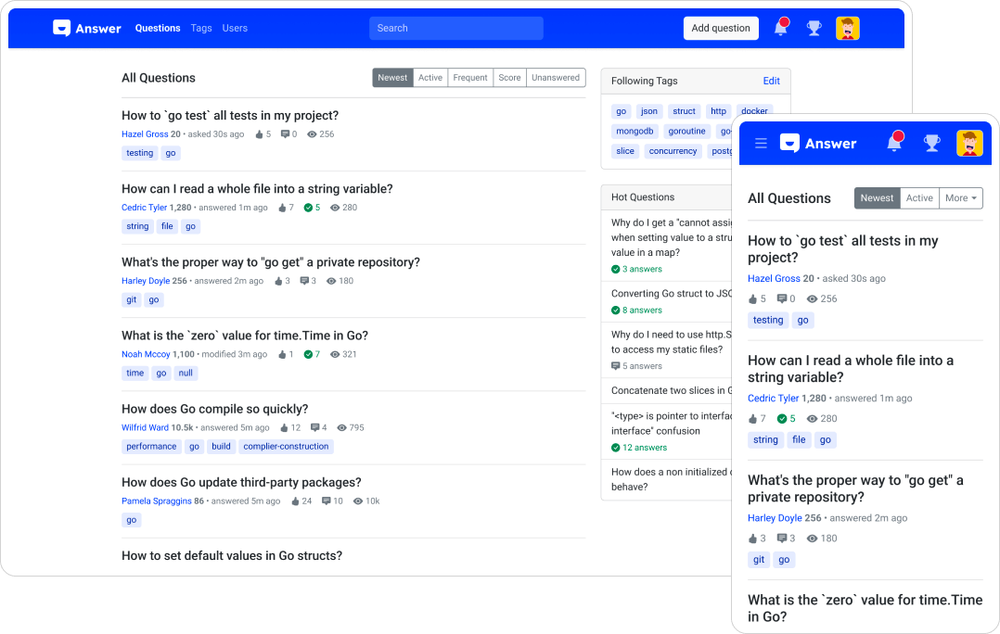
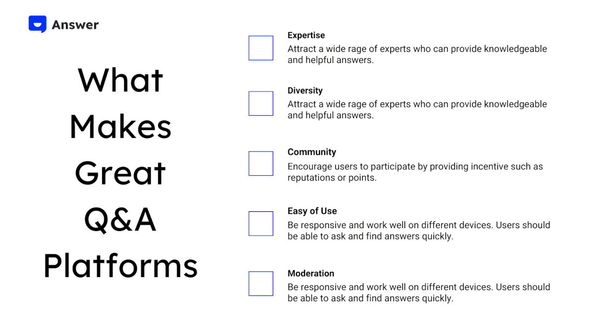

Wszyscy mamy pytania i potrzebujemy odpowiedzi w tym pędzącym świecie. Kluczowe znaczenie może mieć posiadanie wiarygodnych źródeł informacji, czy to w celach służbowych, czy osobistych. W tym miejscu wchodzi platforma Q&A (pytania i odpowiedzi)... cała na biało.

Wg przewidywań [Verified Market Research](https://www.verifiedmarketresearch.com/product/qa-platforms-market/) rynek platform Q&A osiągnie 5200,18 do roku 2027, co oznacza wzrost CAGR o 8.17% w latach 2020 - 2027.

W tym artykule wgryziemy się w Q&A, odkryjemy popularne platformy Q&A i zastanowimy się, co można zrobić, aby jak najlepiej je wykorzystać.

## Czym jest platforma Q&A

Platforma Q&A jest stroną internetową lub aplikacją, w której użytkownik wraz z innymi użytkownikami i ekspertami może zadawać i odpowiadać na pytania dotyczące różnych tematów.

Pod koniec lat 90. została uruchomiona bezpłatna usługa internetowa o nazwie [ Answer Point ](https://www.ask.com/) udostępniona przez [Ask Jeeves](https://en.wikipedia.org/wiki/Ask_Jeeves), pozwalając użytkownikom na zadawanie pytań, a także z pomocą innych osób, na udzielanie odpowiedzi. Była inspiracją do utworzenia witryny Q&A. Ostatnia zarchiwizowana wersja Ask Point była z końca roku 2001, kiedy to nadal zezwalała na rejestrację.

Platforma Q&A ma on na celu ułatwienie wymiany informacji i wiedzy skupionej wokół konkretnego tematu lub obszaru zainteresowania, np. programowanie, technologia, zdrowie lub edukacja. Podejście oparte na społeczności dzielenia się wiedzą umożliwia użytkownikom posiadającym wiedzę specjalistyczną w różnych dziedzinach udzielenie przydatnych odpowiedzi innym.

### Typy platform Q&A

Istnieje wiele przykładów platform Q&A zarówno w formie open source, jak i usług SaaS.

Open source otwiera kod źródłowy dla ogółu społeczeństwa, a użytkownicy mogą go modyfikować i rozpowszechniać. Może być dostosowany do konkretnych potrzeb i być bardziej przystępny. Zamknięte źródłowe platformy Q&A mają zastrzeżony kod źródłowy i są własnością konkretnej firmy lub organizacji. Oto jedne z popularniejszych platform Q&A:

1. [Quora](https://www.quora.com/) - Quora jest jedną z najpopularniejszych platform Q&A posiadająca miliony użytkowników z całego świata. Obejmuje ona szeroki wachlarz tematów, od ogólnych kwestii związanych z wiedzą po bardziej szczegółowe zagadnienia, takie jak kwestie techniczne czy doradztwo medyczne.

2. [Stack Exchange](https://stackexchange.com/) - Stack Exchange jest siecią serwisów Q&A z których każdy jest poświęcony konkretnemu tematowi. I tak na przykład Stack Overflow jest dedykowane na pytania związane z programowaniem, zaś Server Fault koncentruje się na pytaniach związanych z serwerami.

3. [Reddit AMA](https://www.reddit.com/r/AMA/) - Reddit AMA (Ask Me Anything) jest popularną platformą Q&A a fundamentem tej społeczności jest zadawanie pytań przez użytkowników osobom o ciekawych lub nietypowych doświadczeniach. W AMA często uczestniczą celebryci, politycy i eksperci z różnych dziedzin.

## Dlaczego uwielbiamy platformę Q&A

Platformy Q&A stają się coraz bardziej popularne na przestrzeni lat. Dostarczają one nie tylko cennego zasobu, jakim jest wiedza dla osób, które chcą dowiedzieć się więcej lub uzyskać pomoc w problemie, ale również mogą się przyczynić do powiększenia swojej fachowej wiedzy jak też zrzeszyć się z osobami o podobnych poglądach.

Oto kilka przykładów praktycznego wykorzystania platformy Q&A:

### Niezależność

1. Rozwiązuje problem lub zadania, z którym się borykasz
2. Edukuje o konkretnym temacie lub przedmiocie
3. Wskazuje rekomendacje dotyczące produktów lub usług
4. Zrzesza z innymi osobami o podobnych zainteresowaniach

### Firmy i organizacje

1. Obsługa klienta  
   Jednym z najpopularniejszych przypadków użycia platform Q&A jest obsługa klientów. Wiele przedsiębiorstw korzysta z platform Q&A do obsługi zapytań przez klientów, rozwiązywania problemów i udzielania wsparcia w odniesieniu do różnych produktów i usług.

2. Dzielenie się wiedzą  
   Platformy Q&A są również świetnym rozwiązaniem do dzielenia się wiedzą i doświadczeniem. Mogą one być wykorzystywane do zadawania i udzielania odpowiedzi na pytania dotyczące wielu tematów, od pytań technicznych aż po dyskusje akademickie. Może to być szczególnie cenne dla osób poszukujących informacji na temat konkretnych zagadnień lub dla przedsiębiorstw pragnących podzielić się swoją wiedzą z liczniejszą publicznością.

3. Szkolenie pracowników  
   Platformy Q&A mogą być również używane do szkolenia pracowników i ich rozwoju. They can be used to create a knowledge base for employees, allowing them to ask and answer questions about company policies, procedures, and best practices.

4. Recruitment  
   Q&A platforms can be a valuable tool for recruitment. They can be used to answer questions about job openings, company culture, and career opportunities, giving potential candidates a better understanding of the organization they may be joining.

5. Research  
   Last but not least, Q&A platforms can also be used for research purposes. They can be used to ask and answer questions on a variety of topics, helping individuals and organizations gather information and insights on specific subjects.

## What Makes a Great Q&A Platform

These are some key factors that not only makes a great Q&A platform for both question askers and answers, and find out how we apply them in [meta.answer](https://meta.answer.dev/), a community built with Answer.

* **Expertise:** A great Q&A platform should attract a wide range of experts who can provide knowledgeable and helpful answers. The platform should also make it easy for users to identify these experts and trust their responses.
* **Diversity:** A great Q&A platform attracts a diverse group of users who have expertise and knowledge in different areas. This diversity of expertise can provide valuable insights and perspectives, and can help to foster a collaborative and supportive community.
* **Community:** A great Q&A platform has an active and engaged community of users who are willing to share their knowledge and help others. The platform should encourage users to participate by providing incentives such as badges or points, and by creating a welcoming and supportive environment.
* **Easy of Use:** A great Q&A platform should be easy to use and navigate. Users should be able to ask questions and find answers quickly and easily. The platform should also be responsive and work well on different devices.
* **Moderation:** A great Q&A platform has effective moderation to ensure that users are following the rules and guidelines of the community. Moderation can help to prevent spam, trolling, and other negative behaviors that can detract from the quality of the platform.

## Build a Q&A Platform in 3 Steps

Follow the guide to build a basic Q&A platform, easy-peasy.

1. Choose a Platform  
   Choose a platform that aligns with your needs and budget. There are open-source Q&A platforms available that offer a good starting point (you know, [Answer](https://answer.apache.org/) is open-source). Alternatively, you can use a hosted platform.

2. Customize the Design  
   Once you have chosen a platform, customize the design to match your branding and user interface requirements. Don’t forget to make the design responsive and optimized for different devices.

3. Add Questions and Answers  
   Create a few test questions and answers to give users an idea of what types of questions are appropriate and how to answer them. Encourage users to ask and answer questions, and here’s [a quick tip to kick-start a good question](https://meta.answer.dev/questions/D1L1/how-to-ask-a-good-question). Later on, moderate the content to ensure quality and adherence to community guidelines.

## Start and Manage Q&A Platform with Answer

Answer is knowledge-based community software, offering a smooth set-up for your Q&A platform. Its nature of open source lets you customize a Q&A platform for a big take-off. Take a glimpse at the [Answer community](https://meta.answer.dev/) built with Answer.

No matter what your Q&A platform is about, it’s always great to collect valuable insights and perspectives, and keep up-to-date answers. We’ve also packed up these resources that help you kick-start a joyful Answer journey:

💻 [GitHub Repo](https://github.com/apache/incubator-answer): Keep an eye on what we are up to lately on GitHub. 📄[Documents](https://answer.apache.org/docs/): Everything you need to build your Answer Community from zero to hero. 🐞 [Bug Report](https://github.com/apache/incubator-answer/issues): Hunt a bug? Simply report it for us to track efficiently. 🚩[Public Roadmap](https://github.com/apache/incubator-answer/projects): Feel free to drop a comment here and be a part of our roadmap!

## Wnioski

Prozą życia jest szukanie odpowiedzi na pytania, więc jednym z naturalnych rozwiązań wydaje się posiadanie platformy Q&A. Dzięki [Answer](https://answer.apache.org/), Ty i Twój zespół będzie w stanie rozwiązać problemy, uczestniczyć w dyskusjach i wnosić wkład w nowe pomysły mające na celu podtrzymanie rozwoju przedsiębiorstw.
