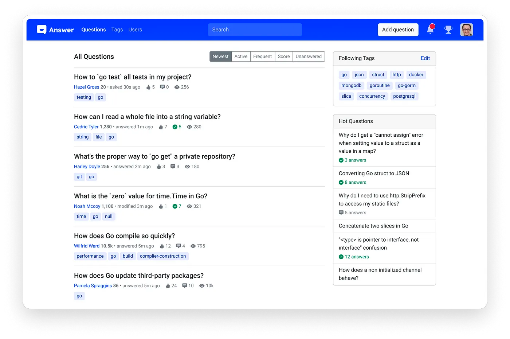

Whether it's for business or personal use, having software that aligns with our workflows, preferences, and objectives is crucial for maximizing productivity. That’s why we actively seek and try different software solutions that can be customized and personalized to suit our specific requirements.

That's when open-source software — offering a collaborative, effective, and secure experience — showed up. Open source forms the heart and soul of Answer since the day Answer launched.

Before knowing why Answer is open-source, we will take a nibble on open-source, and examples beforehand.

## What is Open-source?

[Open source](https://opensource.com/article/18/2/coining-term-open-source-software) refers to a type of software or technology that comes with its source code which is accessible to the public for free. This means that anyone can view, modify, and distribute the code, following the guidelines outlined in the open-source license. For example, programmers can add features or fix a bug with the access to the source code.

 Photo by [Markus Spiske](https://unsplash.com/@markusspiske?utm_source=unsplash&utm_medium=referral&utm_content=creditCopyText) on [Unsplash](https://unsplash.com/s/photos/open-source-software?utm_source=unsplash&utm_medium=referral&utm_content=creditCopyText)

It promotes collaboration, transparency, and community-driven development, often maintained by volunteers working together to create reliable and innovative solutions.

## Open-source Software

We might have already met or used open-source software before, and here are them.

1. [Linux](https://www.linux.org/): an operating system that powers many servers, smartphones, and other devices.
2. [Python](https://www.python.org/): a high-level programming language that is used for web development, data analysis, artificial intelligence, and more.
3. [Firefox](https://www.mozilla.org/en-US/firefox/new/): a web browser developed by the Mozilla Foundation.
4. [LibreOffice](https://www.libreoffice.org/): an open-source office suite that includes word processing, spreadsheet, and presentation software.
5. [Apache HTTP web server](https://httpd.apache.org/): a web server software that powers many websites on the internet
6. [OpenCV](https://opencv.org/): a computer vision library used for image and video analysis.
7. [VLC](https://www.videolan.org/): a media player that can play a wide range of video and audio formats.
8. [WordPress](https://wordpress.com/): a content management system (CMS) for creating websites and blogs.

## Answer: Open-source is in Essence

Lately, B2B enterprises have been looking for solutions on building their own Q&A community or a corporate community. A dedicated section or subsection cannot meet their needs because they wish to customize content, have control of data, rather than “being a guest” in a public community.

That’s the moment we decided to build Answer.

### We Wish Answer to be …

**Easy to use**  
We hope everyone can set up and run Answer at ease — well, maybe with a little guidance and documentation from us :)

**Built for Everyone** Currently, running community software or open-source products in the market still requires professional knowledge, such as understanding technical terms. We want Answer to have a bigger stage and to embrace a bigger world. Thus, in the initial design of Answer, we always considered the user as a novice, and how can they get started with Answer smoothly.

**Open-source** You can find all the source code of Answer in [GitHub Repo](https://github.com/apache/incubator-answer), free for everybody. We love the spirit of how open source encourages collaboration and transparency, and we always welcome contributions ;)

## Where Can I Find More about Answer

No matter you are a Q&A lover, self-host expert, or want-to-give-it-try person, you can always get connected with us, share new ideas, or simply for chatting.

1. [Website](https://answer.apache.org/): Welcome to the home of Answer. We know there are plenty of things that need to be improved. We are working on it, we promise.
2. [GitHub Repo](https://github.com/apache/incubator-answer): Enjoy your stay in the garden of Answer.
3. [Meta.Answer](https://meta.answer.dev/): The one and only official community built with Answer, meet new friends here.
4. [Twitter](https://twitter.com/answerdev): What we’ve been up to, tutorials, and tips. Follow us to keep updated.
5. [Discord](https://discord.gg/a6PZZbfnFx): Want to talk to our dev team in real time? Join our Discord Server!
