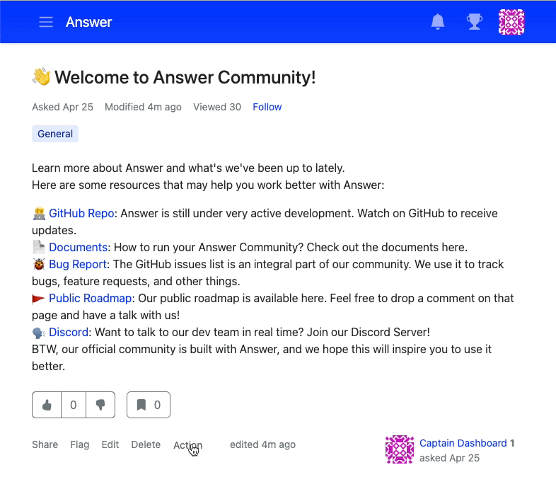

最新版本的 Answer 进行了新的调整、改进和优化， 请深入了解如何有效地管理问题。

## 最新动态
在您的 Q&A 平台中，将重要或常见的问题置顶，这样它总会出现在你的社区的顶部。 

您可以将一个问题设为不可见，以便暂时进行修改或进一步审查。 管理员可以在 Admin > Contents > Questions 里再次公开这个问题。 

使用置顶和隐藏功能，您可以更好地定制自己的知识型社区，同时维护和组织知识系统也更加简单。

## Bug 修复和优化
我们做了一些调整来修复标签显示问题、评论表单和难以删除的问题， 我们还通过优化翻译消除了上下文歧义。

我们强烈推荐您构建并管理一个 Q&A 平台 —— Answer v1.0.9。 非常欢迎您在 https://meta.answer.dev/ 上提出您的想法（比如新的功能需求或是寻找 bug）。 那么，您会首先置顶哪个问题呢？
