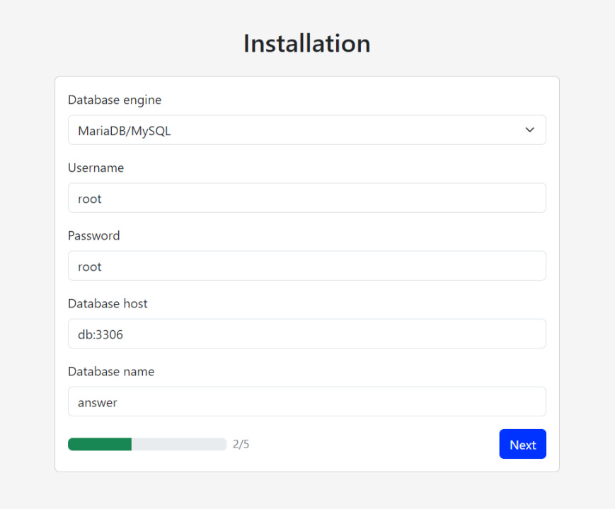
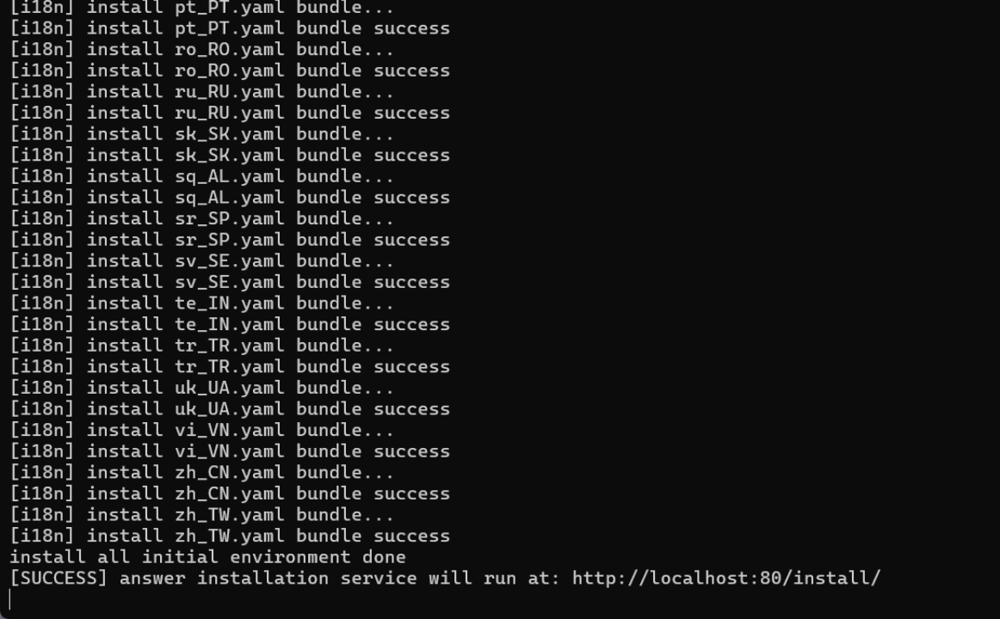
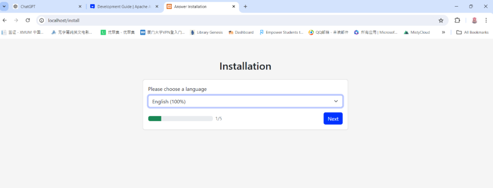
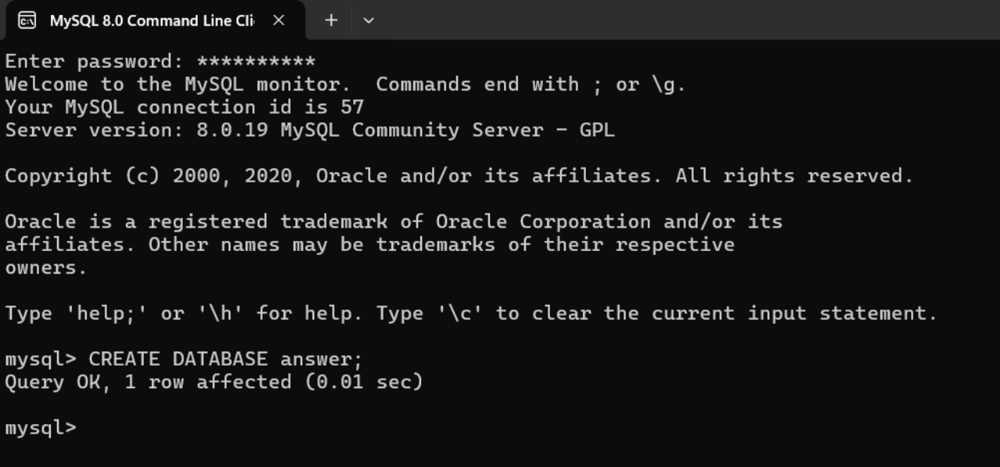
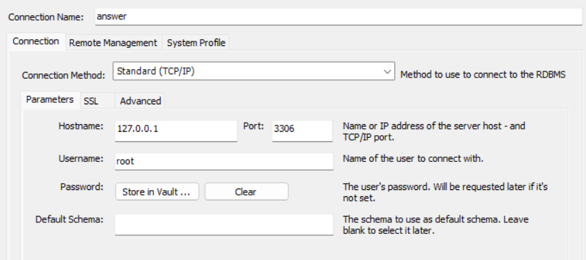
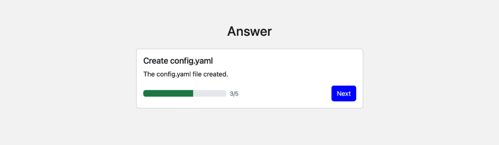
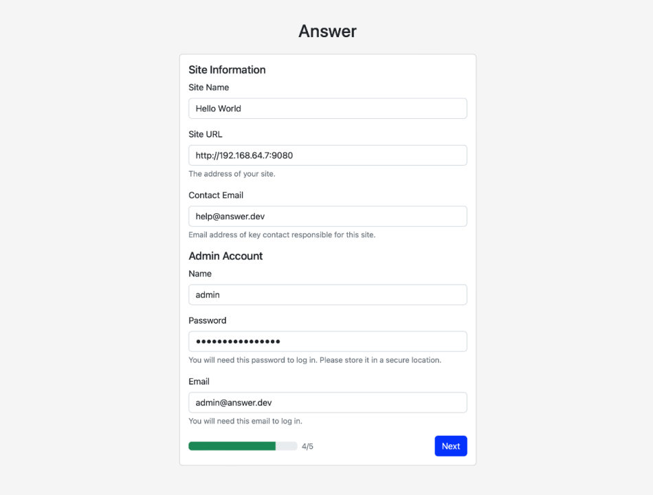
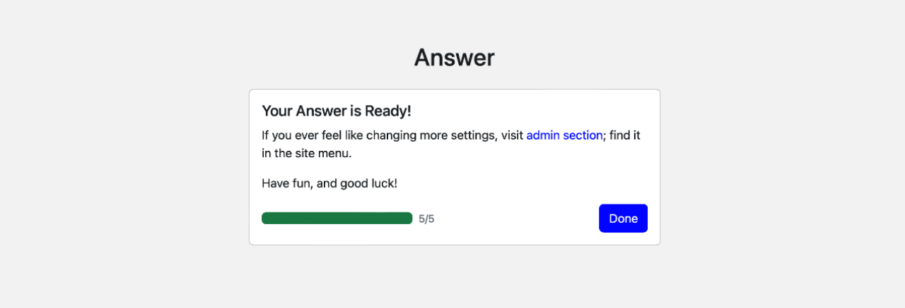
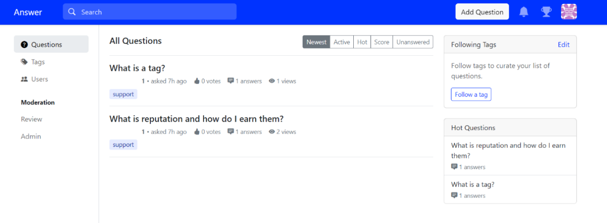

在 [Apache Answer 前端配置指南](https://answer.apache.org/zh-CN/blog/2024/08/16/apache-answer-frontend-configuration-guide)中，相信大家都能跟随每一步完成前端配置。本文将详细指导你如何配置 Apache Answer 的后端，我们将一步一步地进行讲解，确保每个人都能上手并成功运行。 你可以使用自己的数据库软件创建 Answer 数据库
Apache Answer 支持 MySQL、PostgreSQL 和 SQLite 作为数据库后端。环境最小的是 SQLite，不需要任何额外配置。
如果要使用 MySQL 或 PostgreSQL，则需要**先设置数据库**，然后在此步骤中配置数据库连接。
 We will go through each step, ensuring that everyone can get started and run the backend successfully.

## 准备工作

1. 下载 Golang
   从[官方网站](https://go.dev/doc/install)下载并安装 Go 语言, 按默认设置安装即可。 Follow the default settings for installation.

2. Clone Answer 项目
   确保你已经克隆了 Apache Answer 到本地，如还未克隆，请阅读 [Apache Answer 前端配置指南](https://answer.apache.org/zh-CN/blog/2024/08/16/apache-answer-frontend-configuration-guide)。 
   看到 `[SUCCESS]` 即运行成功，**注意此时不要关闭该程序**。在网页输入所提示的网址：`http://localhost:80/install/`，打开并进行下一步安装。

## I. 一、初始化项目

在 Answer 项目根目录打开`命令行终端`运行以下命令。

```
go mod download
go run cmd/answer/main.go init -C ./answer-data
```

_Note: If the first command doesn't work, try running the second one. The process may take some time, please be patient._


When you see [SUCCESS], means the operation has done. **Do not close this program at this time.** Enter the prompted URL `http://localhost:80/install/` in your web browser to open and proceed with the next step of the installation.

_注：如果打开网址找不到此localhost页面，尝试先运行以下命令再重试_

```
cd ./ui
pnpm pre-install
pnpm install
pnpm build
cd ..
```

## II. 二、安装界面

Open `http://localhost:80/install/`, and you will see the following interface. The first step is to choose the language.


### 2.1 配置数据库

You can create an Answer database using your own database software.
Apache Answer supports MySQL, PostgreSQL, and SQLite as database backends. The smallest environment requirement is SQLite, which doesn't need any additional configuration.
If you plan to use MySQL or PostgreSQL, you need to **set up the database first** and then configure the database connection in this step.


**本文将以 MySQL 为例进行说明。**

#### 创建数据库

在`MySQL 命令行`中创建一个名为 answer 的数据库：


#### 配置数据库连接

访问 `http://localhost:80/install/`，在安装界面中输入你的数据库连接信息：

- User name: root
- Database host: 127.0.0.1:3306
- Password: 你的数据库密码
  

### 2.2 创建配置文件

在安装界面中，按照提示创建 `config.yaml` 文件。



### 2.3 设置网页信息和管理员账号

请记住网站URL（如`http://localhost`）以及管理员账号信息密码，方便后续登陆。



### 2.4 完成安装



## III. Run the Backend

回到`命令行终端`，在answer项目根目录运行以下命令启动后端服务器 。

```
go run cmd/answer/main.go run -C ./answer-data
```

## IV. 四、验证安装

打开 `http://localhost:80/install/` 将看到以下界面，第一步选择语言。
 Log in with your administrator account. 在浏览器中访问你设置的网站 URL（例如：`http://localhost`），登陆你的管理员账号，如果看到一下页面，即配置成功。


通过以上步骤，你已经成功培植了 Apache Answer 后端。如果遇到其他问题，欢迎你在[社区](https://meta.answer.dev/)中和我们的社区成员进行沟通。我们也非常欢迎你参与到[社区贡献](https://answer.apache.org/zh-CN/community/contributing/)中来，为打造更好的问答平台，一同努力。 If you encounter any issues, feel free to communicate with our community members in the [community](https://meta.answer.dev/). We also warmly welcome you to [contribute to the community](https://answer.apache.org/community/contributing/) and work together to build a better Q&A platform.
