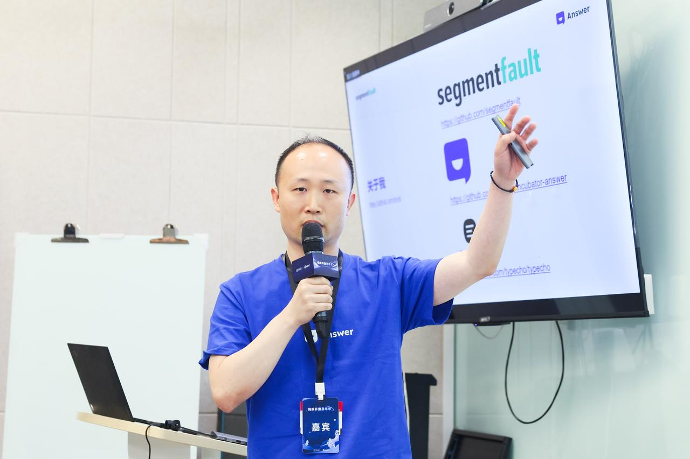
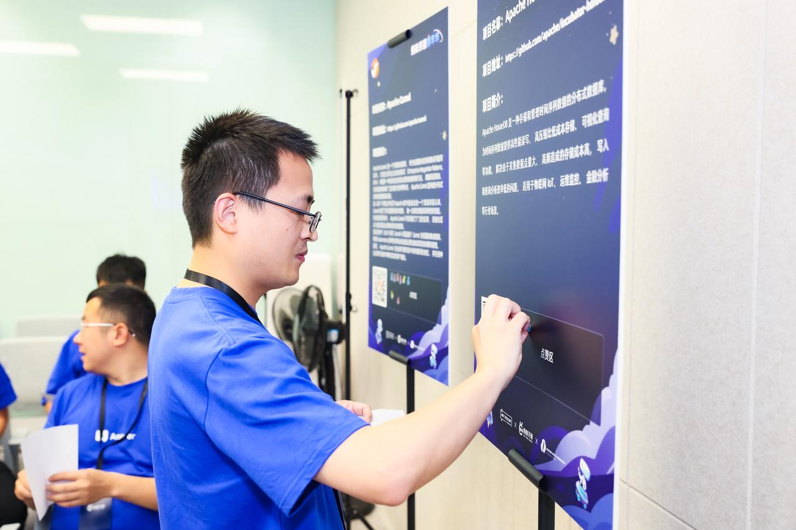

5 月 28 日，Apache Local Community Hangzhou (ALC Hangzhou) 首次线下聚会顺利举办。Apache Answer 作为 ALC Hangzhou 初始成员受邀参加。Answer 大部分 PPMC 成员均参加了活动，其中 PPMC 成员祁宁介绍了社区 Roadmap，并就社区运营、开源社区开发者贡献量等话题分享了 Answer 的最新实践成果。  Apache Answer, as an incubating project within the Apache Software Foundation (ASF), was represented by most of its Project Management Committee (PPMC) members. Joyqi, PPMC member of Answer, introduced Answer with a presentation in the meetup. The presentation covered the project roadmap, community management, contributions, etc.

The meetup attracted a range of attendees from Apache ecosystem. PMC members and core committers from projects including Apache Dubbo, Apache RocketMQ, Apache Flink, Apache Paimon, Apache Fury, Apache Celeborn, and Apache HoraeDB shared and exchanged ideas on open-source field. Additionally, Ni Chao, professor of the School of Software Technology, Zhejiang University also participated in the event.

Nadia Jiang, PPMC member of Answer, delivered opening remarks at the meetup. Apache Answer PPMC 成员江波发表开场致辞。她讲述了第一次参加 ALC Beijing 线下聚会的难忘经历，并分享了她参与组织首届 CommunityOverCode Asia（原 ApacheCon Asia）大会的宝贵经验。

2024 is a milestone for Hangzhou open-source communities — the establishment of ALC Hangzhou, and the upcoming CommunityOverCode Asia 2024 conference, scheduled to take place in Hangzhou from July 26th to 28th. Both are poised to propel the advancement of open-source technologies, foster community growth, and facilitate collaboration among tech professionals.

The establishment of the Apache Local Community Hangzhou (ALC Hangzhou) and the upcoming CommunityOverCode Asia 2024 conference, scheduled for July 26-28 in Hangzhou, mark significant developments for the city's open-source communities.

随后，Apache Answer PPMC 成员祁宁向大家介绍了 Answer 项目的背景故事、发展现状、和愿景，呼吁更多的贡献者加入到 Answer 社区中，一起打造一个更加强大的生态系统。

Community is the driving force for Answer. Today, Answer’s community gathers 59 core contributors, 122 translation contributors, 12 website contributors, and 12 plugin contributors. They follow a monthly release cycle and push the boundary of Answer every day.

The meetup concluded with an open discussion session, allowing participants to engage in exchanging ideas. Members of Answer project asked other established projects and communities, seeking guidance on addressing project challenges, successful graduation notes, and attracting contributors.

A project showcase area was set up at the event, where developers could learn about other projects in the ALC Hangzhou meetup quickly. Attendees were invited to leave stickers on the showcase boards to express their appreciation for the projects they found most interesting.

The meetup of ALC Hangzhou was a valuable opportunity for connection and learning. LinkinStars, an Apache Answer PPMC member, expressed excitement the upcoming launch of the open-source collaboration platform presented by Chao Ni, professor of Zhejiang University's School of Software Technology. LinkinStars viewed the platform as a potential bridge between universities and open-source communities. He also looked forward to more communities’ involvement.

ALC Hangzhou 的意义不止于技术交流。在 ALC Hangzhou 的发起人刘军看来，“在这样的聚会里我们不仅可以讨论技术，探讨项目合作的可能；大家也可以聊聊开源以外的话题——分享自己的生活”。 As Jun Liu, the initiator of ALC Hangzhou, said, “The meetup goes beyond open-source technology and potential collaborations. It offers a space for casual topics, like sharing personal experience or stories.”

我们期待有更多开源爱好者加入 ALC Hangzhou， 一起为开源做出更大的贡献，Answer 会持续关注和参与到后续 ALC Hangzhou 的活动当中。 Answer will keep supporting and participating in future ALC Hangzhou events.

## About Apache Local Community (ALC) <a href="#ref1">[1]</a>

ALC 是 Apache Local Community 的缩写，是全世界范围的 Apache 开源爱好者本地群组。因为是本地组织，ALC 是按照城市或地区的方式进行划分的，类似的机构还有 GDG (Google Developer Group), Facebook Developer Circles, Mozilla Reps 等。任何 Apache 开源爱好者都可以代表自己所在的城市向 ALC 提出申请创建本地的组织。 There will be a single ALC chapter per town/city.

ALC is similar to [Google Developer Group](https://developers.google.com/programs/community/gdg/), [Facebook Developer Circles](https://developers.facebook.com/developercircles/), [Mozilla Reps](https://reps.mozilla.org/about/).

## 关于 ALC Hangzhou

ALC Hangzhou 将致力于通过（但不限于）下述行动帮助开源爱好者更好的在 Apache 社区生根发芽：

- Bring together developers and users with online and offline workshops or meetups.
- Share open-source knowledge and experience.
- 为 ASF 的项目寻找相互合作的机会，让这些项目能够更加茁壮地成长。
- Introduce ASF, The Apache Way, and various Apache projects.

## 如何加入

ALC Hangzhou is open to every open-source enthusiast who align with the Apache Way and love open collaboration. Here are the ways to get involve:

1. 参与 ALC Hangzhou 的活动\
   大家可以通过关注 ALC Hangzhou 公众号<a href="#ref1">[1]</a>和官网<a href="#ref2">[2]</a>获取最新的活动信息，并参加 ALC Hangzhou 的线上线下活动。 Answer 作为 ALC Hangzhou 初始成员受邀参加首次线下聚会，和多个 Apache 项目进行分享和交流。

2. 成为 ALC Hangzhou 成员
   ALC Hangzhou 作为一个公益组织，需要志愿者来帮助协调和组织活动。志愿者加入的原则和Apache软件基金的其他项目发展 Committer 以及 PMC 成员的方式一样, 基于大家在社区中的贡献，采用投票邀请方式进行。<a href="#ref3">[3]</a> The principles for becoming an ALC Hangzhou volunteer are similar to those for Committer and PMC members in other Apache Software Foundation projects. The selection is based on individual contributions to the community and involves a voting process <a href="#ref4">[4]</a>.

引用链接

只要你认同 Apache Way 并乐于和开源社区一起协作小伙伴都可以参与进来！具体的方式如下：
 

[2] WeChat Public Account：alc_hangzhou 

 [1] 微信公众号ID：alc_hangzhou         
 [2] https://cwiki.apache.org/confluence/display/COMDEV/ALC+Hangzhou         
 [3] https://cwiki.apache.org/confluence/display/COMDEV/Guidelines+to+manage+an+ALC+Chapter 

[^1] 微信公众号ID：alc_hangzhou          
[^2] https://cwiki.apache.org/confluence/display/COMDEV/ALC+Hangzhou        
[^3] https://cwiki.apache.org/confluence/display/COMDEV/Guidelines+to+manage+an+ALC+Chapter

