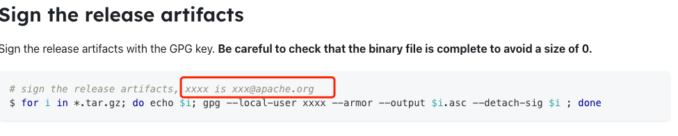
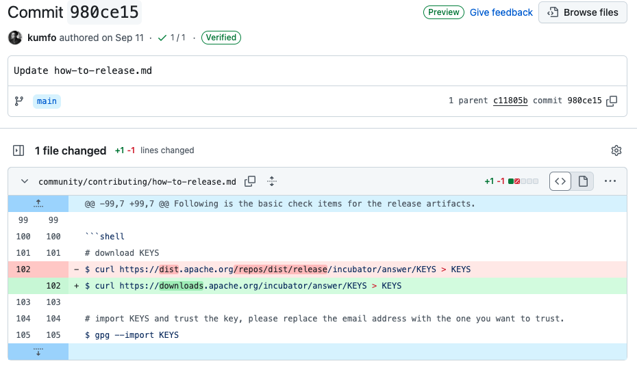
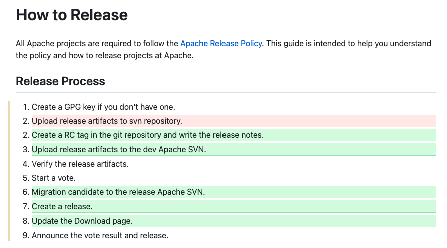
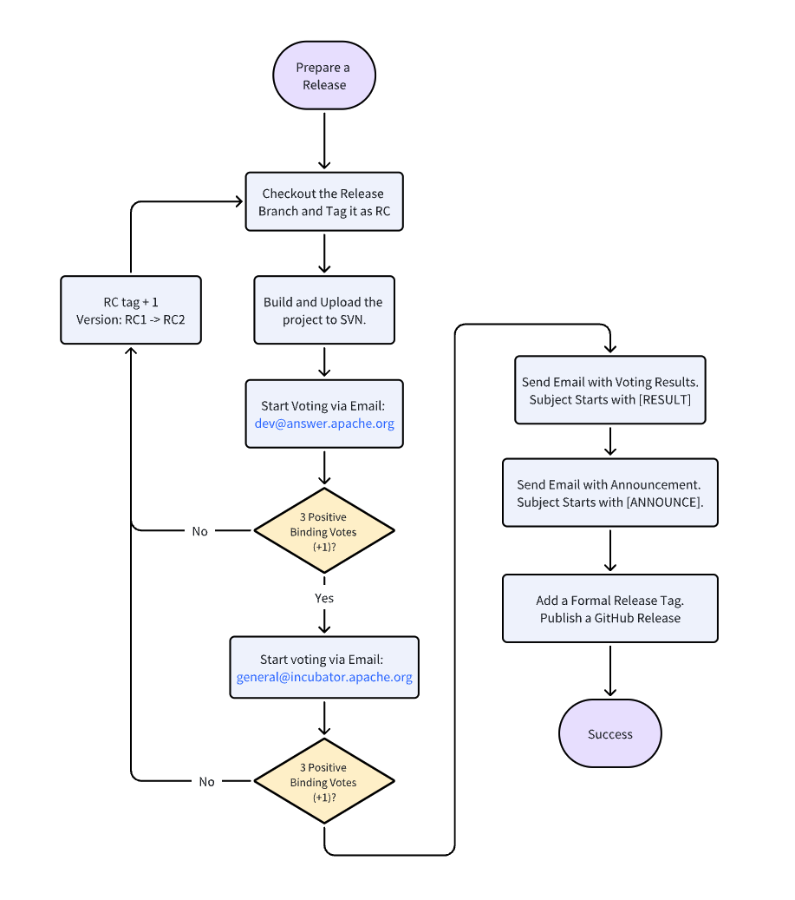
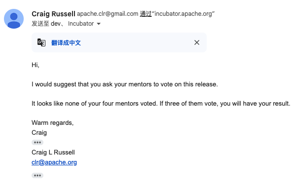

An Apache release follows a rigorous process with valid, signed, artifacts, voted on by the appropriate PMC and ultimately distributed on the official ASF release infrastructure. Each project designates a committer to be release manager for release preparation, execution, and document maintenance, etc. Apache encourages committers to take turns in this role for different release, ensuring release quality, efficiency, and process optimization.

Since joining the Apache Incubator in October 2023, Apache Answer has released 8 Apache versions with 4 release managers involved. With their help, the project has accumulated Apache release experience. The process of merging code and packaging has become smoother, the Release doc includes more details, and the recent added email templates make writing voting emails easier.

在今天这篇博客里，我们将一同回顾 Release Manager 们在发版过程里遇到的问题，如何解决，以及 Release Doc 和发版流程的迭代优化。

## Release Doc 的迭代

As the foundation of the release, the release doc provides detailed guidance. It also serves as a testament to the project’s maturity and independence in release management.

LinkinStars, a backend engineer, became Apache Answer’s [first release manager](https://answer.apache.org/blog/meet-our-release-manager-linkinstars). He crafted the initial version of the release doc with an entire release cycle and final deployment. In this version, the release doc packed with process from packaging, signing, verification, and uploading, as well as email templates. With his help, Apache Answer’s [first Apache release](https://answer.apache.org/zh-CN/blog/a-new-chapter-begins-answer-first-apache-release-launches) was successfully launched on November 29th, 2023.

Later on, the PPMC members started to take turns following the guidance of the mentor. By rotating this role, the community was not only familiarized with the release process but also able to identify the optimization gap.

Apache Answer 的第二位 Release Manager 是前端开发 shuai。他从 0-1 完成了 Apache Answer 的前端搭建，发版更新，以及编辑构建相关的优化等。此外，他经常还活跃在社区里，为其他社区成员答疑解惑。shuai 在发布过程中，对 Release Doc 进行初步补充，包括 GPG 密钥参数的解释、发布文件校验方法以及邮件主题链接的获取方式。 He took up the torch and became the second release manager. During the release process, he enhanced the doc by elaborating of GPG keys, methods of file verification, and ways to obtain email links.

kumfo 接棒了 shuai 成为 Apache Answer 的第三位 Release Manager，作为一名后端开发，他参与到了声望、点赞等事件相关的功能开发， 他根据 IPMC Member 的意见进行了修改和补充。 As a backend developer, he contributed to the development of features related to reputation, upvoting, and other event-driven functionalities. He made modifications and additions based on feedback from IPMC Members.

Currently, the baton for releasing Apache Answer has passed to robin. He has made more detailed revisions to the documentation, such as breaking down some release steps, adding more details, and reorganizing the structure of the document for better clarity and sequence.

Read the latest [release docs](https://answer.apache.org/community/how-to-release) proudly presented and polished by the release managers.

## 挑战 & 解决方案

对于 LinkinStars 来说，第一次发布无疑是一次巨大的挑战。他先是与其他 PPMC Member 收集和整理相关的发布文档，整理成初步的发布流程。 He first worked with other PPMC members to collect and organize the relevant release documentation, creating an initial release process.

Click [here](https://answer.apache.org/blog/behind-the-scene-how-we-launched-the-first-apache-release) to learn more about the behind-the-scenes story of Apache Answer's first Apache release.

After shuai‘s take-over, he referred to LinkinStars’ release documentation and prepared the GPG key and SVN configuration in advance. However, he still faced issues such as incorrect email subject/content, missing content after packaging, and incorrect signatures. To avoid formatting errors caused by copy-pasting in emails, shuai suggested creating a .txt file locally first, where the email template can be edited and modified before copying it into the email editor. He also created a [GitHub repo of Apache release email templates](https://github.com/shuashuai/apache-release-email) to help other release managers avoid encountering such problems in the future.

在遇到 General 投票等待时间较久时，除了发送 [REMINDER] 邮件进行提醒，可优先寻找项目导师进行投票。 However, it is recommended to prioritize seeking vote from mentors.

In the Apache community, all communication is transparent and traceable, which is incredibly helpful for Release Managers referencing past Apache project release processes and emails. The community atmosphere at Apache is open and friendly, and when issues arise, someone will point them out and help resolve them in the emails. For example, during the General vote phase, a mentor pointed out that the release files uploaded to the SVN repository were incorrect, with the signed files having a size of 0. After several rounds of checks, it was found that the release manager had not properly downloaded the release files, and the browser had restricted the content, causing the downloaded files to be incorrect.

When talking to the release managers, all of them have mentioned the importance of collaboration and cooperation among release managers. Besides meticulous and repeated checks during the release, it is highly recommended to invite other release managers to help validate the release to ensure that every step is correct.

在 Apache 的成功毕业指南里的毕业检查清单中，其中一项是展示可以发布 Apache 版本能力。这不仅需要项目有清晰的发版文档和透明的沟通机制，更需要社区各成员的一同努力。从需求分析、开发、测试到最终发布，社区各成员的协同合作是保证发布成功的关键。Apache Answer 欢迎和鼓励更多人加入到社区当中，一起打造更好的问答平台软件。 This requires not only clear release documentation and a transparent communication mechanism but also the collective effort of all community members. From requirement analysis, development, and testing to the final release, the collaboration among community members is key to ensuring a successful release. Apache Answer welcomes and encourages more people to join the community to help build a better Q&A platform software together.
