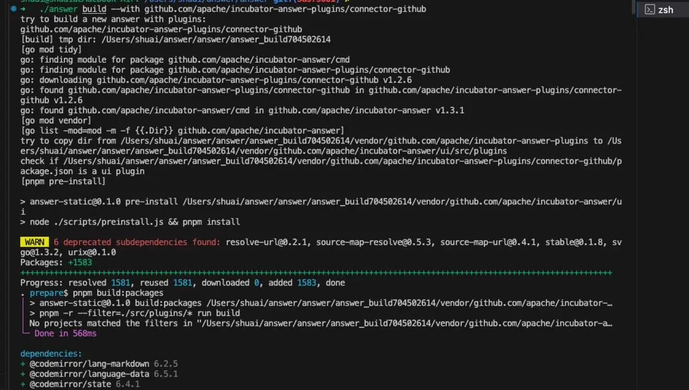
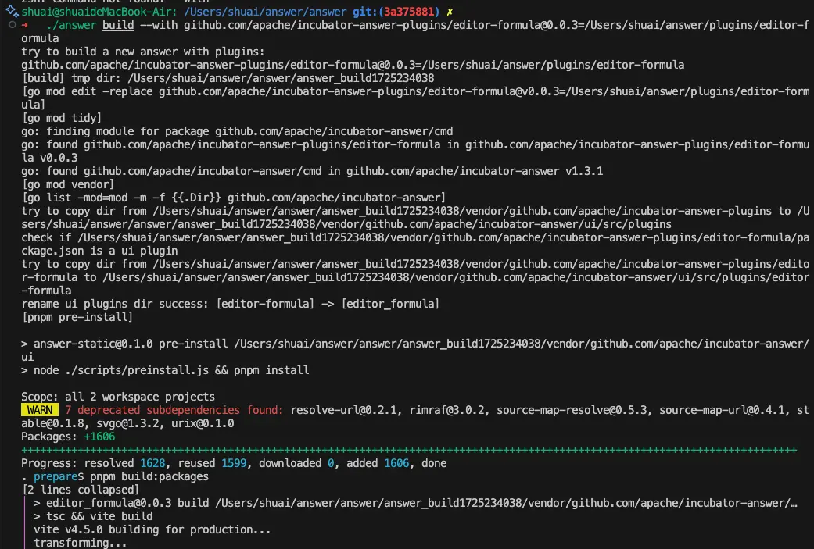

We’ve noticed that some users are struggling to package Answer plugins. It might be frustrating since the doc [using plugins](https://answer.apache.org/docs/plugins/) doesn’t contain successful packaging examples.

In this blog, we’ll guide you through the process of packing your Answer plugin with step-by-step tutorial.

## 完成初始化

在开始之前，请确保您已经配置好了基础的开发环境，包括 Node.js、pnpm、Docker、Go 等。同时，请确保您已经阅读了官方的[开发环境配置文档](https://answer.apache.org/docs/development)。 Don’t forget to check the official documentation for [development guide](https://answer.apache.org/docs/development/).

## 注意

**如果使用的是最新的代码这里可以直接跳过**

在 1.3.5 版本中，对插架的构建流程及部分插件的命令有所调整，如果你用的是 1.3.5 版本之前的代码，需要更改部分插件内部的基础信息。具体涉及到的插件有： If you are using code from before 1.3.5, you need to change the basic information of some internal plugins. The plugins involved are:

1. editor-chart
2. editor-formula
3. embed-basic (该插件 1.3.5版本后才有）

更改的[commit id](https://github.com/apache/answer-plugins/commit/e224fee9b8a0b936e143e852050d9345aa249201), 需要将对应的插件的 `package.json` 文件中的插件名称的 '-' 替换成 '_'， 例如：
 In its package.json files, the hyphens (-) in the plugin name with underscores (\_). For instance:


## I. Build Docker Images with Plugins

构建包含插件的 docker 镜像有两种场景：

1. Answer Base Image
2. 基于本地代码构建

### Build from Answer Base Image

基于官方基础镜像构建 如果您对 Answer 的源码有调整，需要基于自己修改的代码进行构建。请保持本地代码最新，以下是总体步骤： 如果您不需要对 Answer 的源码进行调整，可以直接基于官方基础镜像构建。具体步骤请参考[官方文档](https://answer.apache.org/docs/plugins/#build-with-plugin-from-answer-base-image)构建带有插件的 Docker 镜像，本文不做演示。

### 基于本地代码构建 Docker 镜像总体步骤

Please keep local code up-to-date. The steps are as below:

1. **添加所需插件**：在根目录的 `/script/plugin_list` 文件添加所需要的插架仓库，每行一个
2. **构建 Docker 镜像**：运行 `docker build -t <image_name[:tag]> .` 命令开始构建镜像。
3. **本地启动，验证插件是否正确运行**：等待构建完成后，运行 `docker run -d -p 9080:80 -v answer-data:/data --name <container_name> <image_name>`命令，进行验证。

### 1.添加所需插件

```
github.com/apache/answer-plugins/connector-basic@latest
github.com/apache/answer-plugins/reviewer-basic@latest
github.com/apache/answer-plugins/captcha-basic@latest
github.com/apache/answer-plugins/editor-formula@latest

```

### 2.构建 Docker 镜像

The build process may take some time.
构建需要一定时间请等待构建完成


### 3.本地启动，验证插件是否正确运行

运行下面命令启动，[根据文档](https://answer.apache.org/docs/installation#install-steps)完成初始化, 登录管理后台激活插件，查看插件是否正确运行。

```
docker run -d -p 9080:80 -v answer-data:/data --name answer101 answer-plugin
```

After initialization, log in to the admin panel and see if the plugin runs correctly.

激活插件：


管理后台


确认对应插件（editor-formula）的是否正确运行：


## II. 二：构建包含插件的二进制

下面将指导您如何构建包含特定插件的 Apache Answer 二进制文件。这个过程包括构建基础二进制文件、将所需插件包含在内、本地验证插件以及最终部署该二进制文件。 The process involves building the base binary, incorporating the required plugins, locally verifying the plugins, and finally deploying the binary.

### Steps

1. 构建基础二进制文件
2. 二：构建包含插件的二进制
3. Verify
4. Deploy

### 1.构建基础二进制文件

首先使用 `make ui` 命令构建前端静态资源。

Output:

1. 安装依赖
   
2. 依赖安装完成开始构建静态资源
   

利用基础二进制文件构建所需插件的二进制文件. If the build is successful, the answer binary will be generated in the project root directory.

If you encounter errors related to Go dependency installation, you can try running `go mod download` locally to see if the installation is successful. If it still fails, consider configuring a domestic mirror: https://goproxy.cn/ or enabling a network proxy.

成功结果：


### 2.利用基础二进制文件构建包含所需插件的二进制文件

参考 [Answer 文档](https://answer.apache.org/docs/plugins/#binary-build)

```
# answer build --with [plugin@plugin_version=[replacement]] --output [file]
$ ./answer build --with github.com/apache/answer-plugins/connector-github

# build a new answer with github login plugin then output to ./new_answer.
$ ./answer build --with github.com/apache/answer-plugins/connector-github@1.0.0 --output ./new_answer

# with multiple plugins
$ ./answer build \
--with github.com/apache/answer-plugins/connector-github \
--with github.com/apache/answer-plugins/connector-google

# with local plugins
$ ./answer build --with github.com/apache/answer-plugins/connector-github@1.0.0=/my-local-space

# cross compilation. Build a linux-amd64 binary in macos
$ CGO_ENABLED=0 GOOS=linux GOARCH=amd64 ./answer build --with github.com/apache/answer-plugins/connector-github

# specify the answer version using ANSWER_MODULE environment variable
$ ANSWER_MODULE=github.com/apache/answer@v1.2.0-RC1 ./answer build --with github.com/apache/answer-plugins/connector-github
```

You can choose the required plugins according to the instructions in the documentation. Compiling plugins will rebuild the front-end static resources. Plugins may have special dependencies, so dependency installation and compilation will be performed again here. After successful compilation, the `new_answer` binary file will be generated in the dist directory.

eg:


#### 2.1.打包单个插件

`./answer build --with github.com/apache/answer-plugins/connector-github`

效果：



命令验证插件安装 `./new_answer plugin`


#### 2.2.使用本地插件代码构建单个插件

如果需要调整插件的一些信息或者使用自己实现的私有插件来构建，需要使用 `with local plugins` 命令来构建，比如上面提到的 `editor-formula` 插件，并且使用的 Answer 代码版本是小于 1.3.5 的，所以需要调整插件的一些信息，这种情况就需要使用该命令来完成构建。 在最近的的社区反馈中，部分用户反馈在使用 Answer 插件的过程中，不知道如何将插件打包进入 Answer 系统中，[Answer 插件构建文档](https://answer.apache.org/docs/plugins/)中也没有提示正确结果的示例，所以对于一些非专业的开发者造成了一些困扰，所以本篇将作为一个详细教程，来手把手教会你正确打包 Answer 插件。 In this case, you can use the following command to build the plugin:

`./answer build --with github.com/apache/answer-plugins/editor-formula@0.0.3=/Users/shuai/answer/plugins/editor-formula`

结果：



命令验证插件安装 `./new_answer plugin`


#### 2.3.打包多个插件

The process for building multiple plugins is similar to building a single plugin. Please kindly refer to building single plugin and try it yourself.

### 3.本地验证插件

Using the command line only ensures that the plugins have been installed. To check if the plugins are running correctly, you can run the generated binary file locally. 使用命令行验证只是确保插件已经打进去了，想要查看插件是否能正常运行，可以本地运行生成的二进制文件进行查看，二进制运行[文档](https://answer.apache.org/docs/installation)
, 按照文档步骤初始化完信息。注意这里需要运行的是 new_answer 二进制，所以命令行中的 ./answer 需要使用 ./new_answer


Please pay attention that you need to run the new_answer binary, so replace ./answer with ./new_answer in the command line.

### 4.本地验证步骤

1. 例如： `INSTALL_PORT=80 ./new_answer init -C ./answer-data`


成功后访问 `http://localhost:80/install/`，按照[文档](https://answer.apache.org/docs/installation#install-steps)完成初始化步骤。

2. 运行命令 `./new_answer upgrade -C ./answer-data/` 更新信息

3. 启动本地网站 `./new_answer run -C ./answer-data/`， 访问 `http://localhost/`，登录进去，访问 `http://localhost/admin` 开启插件，验证插件是否生效。 初始化完成后，登录你的网站访问管理后台，激活插件，查看插件是否正确运行即可。

这里使用最后打包的 editor-formula 插件作为示例。


到这一步就可以确定插件是否正确构建并运行了。

### 5.部署该二进制

如果你的网站是使用的二进制进行的部署，那么你现在就可以将该二进制文件进行部署了，如果需要适配不同平台，可以使用文档上面的交叉编译命令来构建二进制文件。 If you need to adapt to different platforms, you can use the cross-compilation commands in the documentation to build the binary file.
