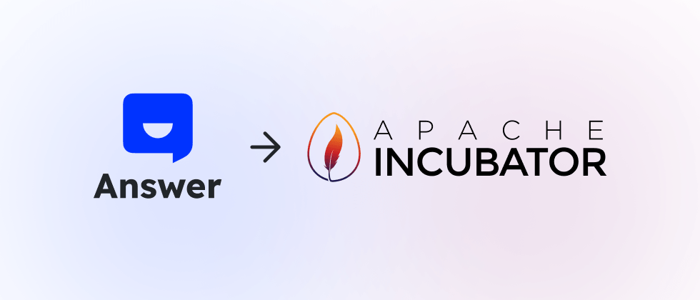

了解 Lu Fei 从开发者到 PPMC Member 的成长之路。
Lu Fei has been involved in Apache Answer community since last October. Today, he has submitted 42 PRs and resolved 31 Issues in both the main and the plugin repository. As an active community member, Lu Fei’s contribution covers bug fixes, new features, and doc improvement.

We invite Lu Fei to share his journey with Apache Answer and we hope that his story can inspire more open-source enthusiasts.

## 初识 Apache Answer

我非常荣幸地成为 Apache Answer 孵化器项目的 PPMC 成员。这不仅是我个人的成长，也是我参与开源社区的一段珍贵旅程。项目进入孵化器，我见证了 Answer 的 PR 号从 2 成长到当前的 577。现在，Answer 已逐渐构建起了一个小型的用户交流和开发者交流社区。 It is more than a milestone, but a valuable open-source journey watching Answer grow from small project to a thriving community.

I actually had a chance to join the SegmentFault team before Answer was even open-sourced, but things didn't work out. Looking back, I kind of kicked myself for missing out on this opportunity!

On October 24th 2022, Answer was launched and open sourced. When I saw that news, I jumped right in and checked on the repo. Then, I submitted my first [PR](https://github.com/apache/incubator-answer/pull/2): `doc: update install`. Answer is built with Go and Node.js while I’m a more of a PHP person, so I was swaying away from it.

The following year, Answer passed the vote and joined the ASF incubator. 次年，恰逢开源一周年，Answer 社区发布公告宣布项目已顺利通过投票，正式进入 Apache 软件基金会（ASF）孵化器，而我在这个时候也提交了我的第二个 [PR](https://github.com/apache/incubator-answer/pull/577): `fix: typo`。

The WeChat group of SegmentFault was buzzing with congrats, while a question arose: 'When can I get my own @apache.org email?' I muted the chat and got back to work but couldn’t help thinking about that question.

## 深入了解 Apache 软件基金会

After Answer became a polling project, I started learning more about it and here’s what I’d love to share.

### Apache 孵化器

The Apache Incubator was started in 2002 to help projects get ready to become part of the ASF. The ASF is huge—it's the world's largest open-source foundation with thousands of contributors working on hundreds of projects. From web servers and big data to storage and machine learning, Apache software is everywhere. And it's all free to use!

Each project in the incubator will be assigned with a few mentors who help guide them as they grow and become fully-fledged ASF projects. Once a project has met all the requirements, it can graduate and become a top-level project (TLP).

### Apache 之道

“Apache Way” 是 Apache 软件基金会（ASF）的核心理念之一，是指在开源项目中遵循的一套社区治理原则。它强调透明、协作和社区驱动的项目管理方式，确保项目不仅仅由少数人掌控，而是由一群贡献者共同推动发展的。以下是 “Apache Way” 的几个关键原则： It emphasizes transparency, collaboration, and community-driven project management, ensuring that projects aren't controlled by a select few but are driven forward by a group of contributors. Here are some key principles of the "Apache Way":

1. Community-Driven Development: Projects are driven by the community, not individuals or companies.
2. 决策透明：所有讨论和决策公开进行，确保每个人都可以看到项目的发展方向和做出贡献的机会。这通常通过邮件列表或公开的讨论平台实现。 It is typically done through mailing lists or public discussion platforms.
3. Consensus-Based Decision Making: Important decisions are made through consensus. This minuses confrontational disagreements while ensuring that most of the community supports key changes to the project.
4. Respect and Inclusion: A welcoming environment for all contributors.
5. Contributor-driven: Everyone has the opportunity to take on greater responsibilities through contributions. The progression from Contributor to Committer to PMC Member (Project Management Committee) is based on contributions and community trust.

By following these principles, Apache projects foster collaboration, innovation, and long-term sustainability.

## Becoming a Committer

I was hooked on Apache Answer because of its tech stack. As a developer eager to learn Go, this was the perfect opportunity to put my skills into practice. I started with `good first issue` which was a great way to get my feet wet. I started with some simple tasks, like fixing typos and adding small features.

The community was incredibly supportive, and with their guidance, I gradually gained a deeper understanding of the project's architecture. As my Go skills improved, so did my contributions. I was thrilled when I was invited to become a Committer in June 2024. After signing the ICLA, I couldn't wait to have my Apache account!

2024 年 6 月 27 日，我收到了 Welcome to the Apache Software Foundation的邮件，并且获得了自己的 ASF 账号。

Just a week later, on July 8th, I was added to the Apache Answer Committer list. Becoming a Committer is more than an identity, but taking on more responsibilities, including code reviews, quality checks, and helping new contributors.

## From Committer to PPMC Member

Becoming a Committer made me even more invested in Apache Answer. Beyond active participation in mailing lists and voting on releases, I started diving into issues, tackling bug fixes and feature enhancements. 除此之外，我也参考了其他 Apache Answer 的插件，[提交新的插件](https://github.com/apache/incubator-answer-plugins/pulls?q=is%3Apr+author%3Asy-records+is%3Aclosed)，丰富插件市场：[腾讯云对象存储 COS](https://github.com/apache/incubator-answer-plugins/tree/main/storage-tencentyuncos)、[钉钉通知](https://github.com/apache/incubator-answer-plugins/tree/main/notification-dingtalk)和[百度内容审核插件](https://github.com/apache/incubator-answer-plugins/tree/main/reviewer-baidu)。

Being nominated for PPMC was both exciting and humbling. As a PPMC member, I’ll be working closely with the community to guide the project's direction, ensure we're following the Apache Way, and attract more developers. It's a big responsibility, but I'm thrilled to be a part of it.

## Join the Community

加入 Apache Answer 社区吧 Whether you're a seasoned pro or just starting out, there’s always a space for you. Every part of Apache Answer, from its design to its code, is the work of talented people like you.

If you're into Q&A platform or open source, you should definitely check it out. Start small, maybe by fixing a typo or improving some documentation. You'll quickly learn the ropes and start making a real impact.

最后，我要感谢 Apache Answer 社区的每一位成员，是你们的支持让我一路成长。希望在未来的日子里，我们能共同努力，将 Apache Answer 打造成更好的问答社区平台，同时能成为更多开发者成长的舞台！ Your support has been incredible, and I'm excited to see where we go next.
